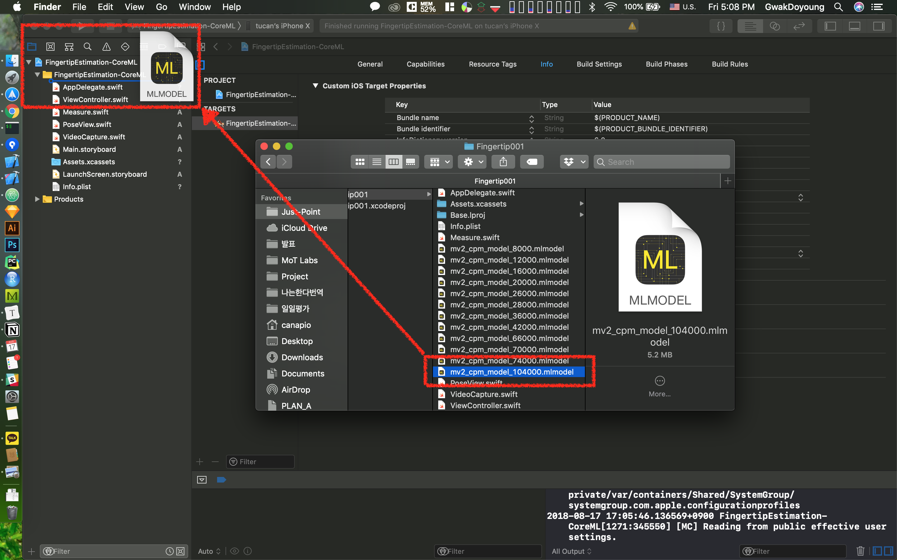

# FingertipEstimation-CoreML
Detect fingertip by using machine learning for pose estimation.

‼️ I don't provide core ml model for estimation. You can get model through training with your own dataset. ‼️

## Build & Run

### 1. Prerequisites

#### 1.1 Prepare your own Core ML model

#### 1.2 Add permission in info.plist for device's camera access

### 2. Dependencies

No external library yet.

## How it works

(preparing...)

## See also

- [motlabs/iOS-Proejcts-with-ML-Models](https://github.com/motlabs/iOS-Proejcts-with-ML-Models) 
  : The challenge using machine learning model created from tensorflow on iOS
- [edvardHua/PoseEstimationForMobile](https://github.com/edvardHua/PoseEstimationForMobile) 
  : TensorFlow project for pose estimation for mobile
- [tucan9389/PoseEstimation-CoreML](tucan9389/PoseEstimation-CoreML) 
  : Parent project for this repository. You can run with [provided model from PoseEstimationForMobile repo](https://github.com/edvardHua/PoseEstimationForMobile/tree/master/release).
- [KeypointAnnotation](https://github.com/tucan9389/KeypointAnnotation)(preparing...) 
  : Annotation tool for own custom estimation dataset